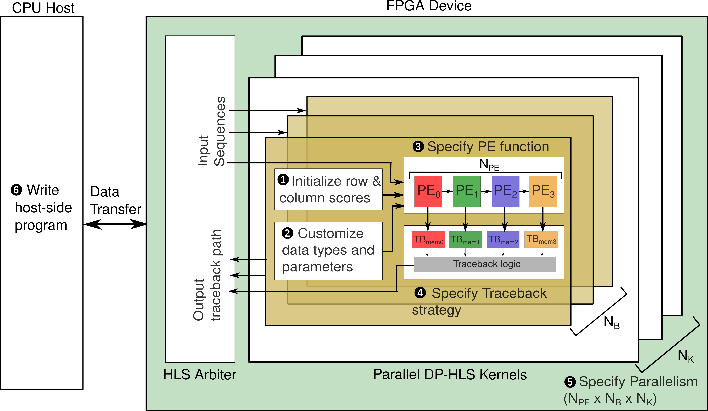

<div align="center">

# DP-HLS: A High-Level Synthesis Framework for Accelerating Dynamic Programming Algorithms in Bioinformatics

<div align="center">


</div>

</div>

## Table of Contents
- [Overview](#overview)
- [Getting Started](#start)
  - [Create Instance](#instance)
  - [Clone the repository](#clone)
  - [Install dependencies](#install) 
  - [Build and simulate the kernel](#custom)
  - [Synthesize the kernel](#synthesize)
  - [Deploy the kernel on FPGA](#deploy)

<br>

## <a name="overview"></a> Overview

Welcome to the official repository of DP-HLS, a framework designed to accelerate algorithms based on the 2-D Dynamic Programming paradigm using High-Level Synthesis (HLS). 

Built with the [AMD Vitis HLS tool](https://docs.amd.com/r/en-US/ug1399-vitis-hls/Introduction), DP-HLS offers a user-friendly template with extensive customization options. This allows you to create and implement FPGA-accelerated kernels tailored to your specific needs, without the necessity of deep RTL design expertise.

With the DP-HLS framework, you can develop efficient DP-based kernels that achieves performance comparable to its hand-coded RTL version, all within a development timeframe of just a few days, and deploy them on [Amazon EC2 F1 FPGA](https://aws.amazon.com/ec2/instance-types/f1/) instances.

<div align="center">



</div>

<figcaption>Figure above shows front-end design of DP-HLS with features and steps to customize kernels.</figcaption>

<br>

## <a name="start"></a>Getting Started

To create, customize and deploy your own kernel on FPGA using DP-HLS framwork, it requires a series of steps to be executed. We have already developed pre-built templates of some of the well known algorithms mentioned in table 1 of the manuscript. These pre-built templates are simulated using standard C++, synthesized using AMD Vitis HLS 2021.1 toolchain on 8-core Amazon EC2 z1d instance and deployed on Amazon EC2 F1 instance based FPGA.

The following sections mentions the steps to quickly simulate, synthesize and deploy global affine kernel which incorporates Needleman-Wunsch algorithm with affine gap penalty. Similar steps need to be followed for other pre-built kernel templates as well. 

### <a name="instance"></a> Step 0: Create AWS instance.

To use our DP-HLS framework quickly to build and run the kernels, it would be preferrable to use AWS instances which comes with the AWS FPGA Developer AMI containing AMD Xilinx Vitis 2021.2. 

### <a name="clone"></a> Step 1: Clone the DP-HLS repository.

### <a name="install"></a> Step 2: Install the required dependencies.

Please make sure the following dependencies are installed in your system.

- g++ >= 4.8.5
- Python > 3.6

### <a name="custom"></a> Step 3: Build and simulate the kernel.

Once the repository is cloned and dependencies are installed, run the following command to build and simulate the kernel.

```bash
mkdir build && cd build
cmake ..
make global_affine 
```

### <a name="synthesize"></a> Step 4: Synthesize the kernel.

Once the build is complete, you need to configure the file `config.json` under `demo/global_affine` by providing the DP-HLS folder path. This pre-configured JSON file will compile and synthesize the Global Affine kernel with `MAX_QUERY_LENGTH` and `MAX_REFERENCE_LENGTH` as 256 each along with 32 PEs, 2 Blocks, and 1 Compute Unit. The input clock frequency is set to 250 MHz. 

```json
{
    "size": {
        "max_problem_size": [
            {"max_query_length": 256, "max_reference_length": 256}
        ],
        "pe_num": [32],
        "blocks": [2],
        "cu": [1]
    },
    "kernel": {
        "name": "seq_align_multiple_static",
        "clock_frequency": 250000000
    },
    "design": {
        "path_params": "<dp_hls_root>/DP-HLS/demo/global_affine/design",
        "path_frontend": "<dp_hls_root>/demo/global_affine/design/kernel_global_affine.cpp",
        "dp-hls_root": "<dp_hls_root>",
        "host_program": "<dp_hls_root>/DP-HLS/src/hosts/host_ocl_global.cpp"
    },
    "output_path": "<dp_hls_root>/demo/global_affine/output/compile",
    "output_name": "global_affine",
    "build": {
        "build_type": "hw"
    },
    "vitis_hls": {
        "cosim_testbench": "<dp_hls_root>/DP-HLS/testbench/test_csim_global_affine.cpp",
        "output_path": "<dp_hls_root>/demo/global_affine/output/cosim",
        "export_design": 0
    }
}
```
Once the JSON file is configured as mentioned above, run the following command for compiling and synthesizing the Global Affine kernel. 

```python
python /home/centos/workspace/DP-HLS/py-hls/parallel_compile.py --config <dp_hls_root>/demo/global_affine/config.json --compile True --num_workers 1 --all True
```

After completion of this step, an `.xclbin` file will be generated which is the bitstream file, used for deploying the kernel on the FPGA device. 

### <a name="deploy"></a> Step 5: Deploy the kernel on FPGA.

Once the compilation is done and the `.xclbin` bitsteram is generated, you need to create an AFI to deploy the kernel. This can be done on any platform. However, we prefer using AWS instances which has AWS FPGA Developer AMI containing AMD Vitis 2021.2.  

First you need to create a S3 bucket for the design checkpoint (DCP) and the logs. 

**1. Create AFI**

Execute the following commands to create an AFI for kernel deployment. 

```bash
git clone https://github.com/aws/aws-fpga.git  # Clone the AWS FPGA Repo
source aws-fpga/vitis_setup.sh     # Setup the Vitis HLS
cd <dp_hls_root>/demo/global_affine/output/compile && <aws_fpga_repo_path>/Vitis/tools/create_vitis_afi.sh -xclbin=./build_dir.hw.xilinx_aws-vu9p-f1_shell-v04261818_201920_3/seq_align_kernel.xclbin -o=./global_affine -s3_bucket=<s3_bucket_name> -s3_dcp_key=<s3_dcp_folder> -s3_logs_key=<s3_logs_folder>
```

**2. Waiting for the AFI to ready** 

You can check whether an AFI is ready using `aws ec2 describe-fpga-images --fpga-image-ids <AFI ID>`. The AFI is ready to use if the status of the code is available, as shown below. 

```json
...
"State": {
    "Code": "available"
},
...
```

**3. Run the kernel** 

You can now run the kernel on AWS F1 FPGA based instances. 

**AWS instance creation**: AWS F1 instance creation can be done with two methods. The first method is to change the instance type of the development instance to be `f1.2xlarge`. The another method is to create an EFS that are capable share files across multiple instances; then you create a new F1 instance with AWS-FPGA repo cloned in it and upload the compilation output folder to the EFS for sharing between the Development and Deployment instance. 

Once you are on the F1 instance, after you can access the compiled bitstream, you can start the kernel by running:

```bash
./dp-hls_host global_affine.awsxclbin
```

**Happy coding with DP-HLS!**
