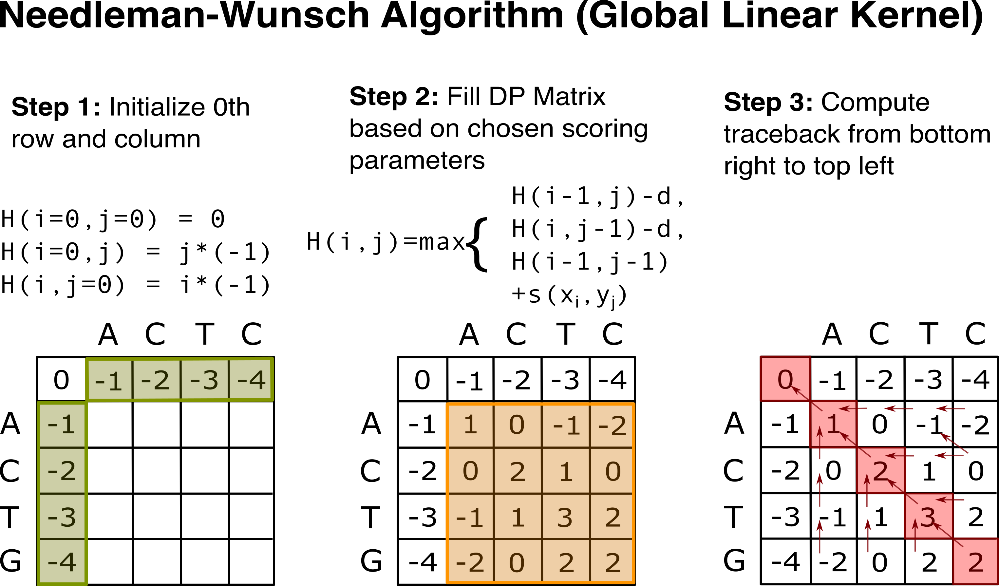
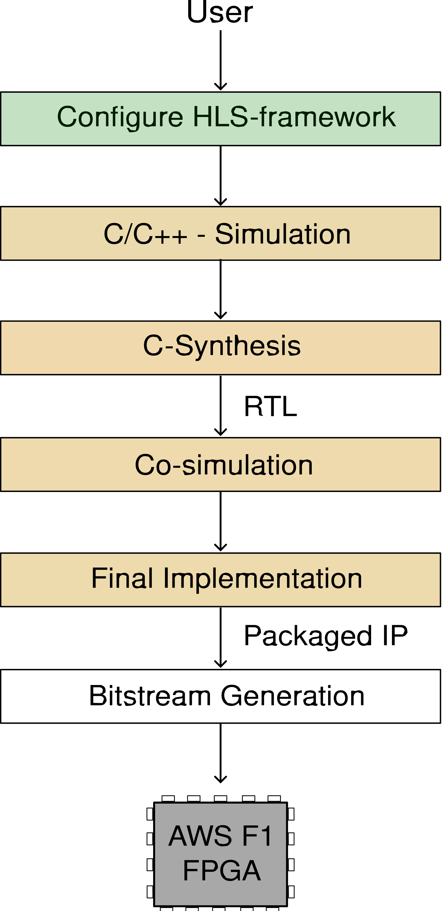
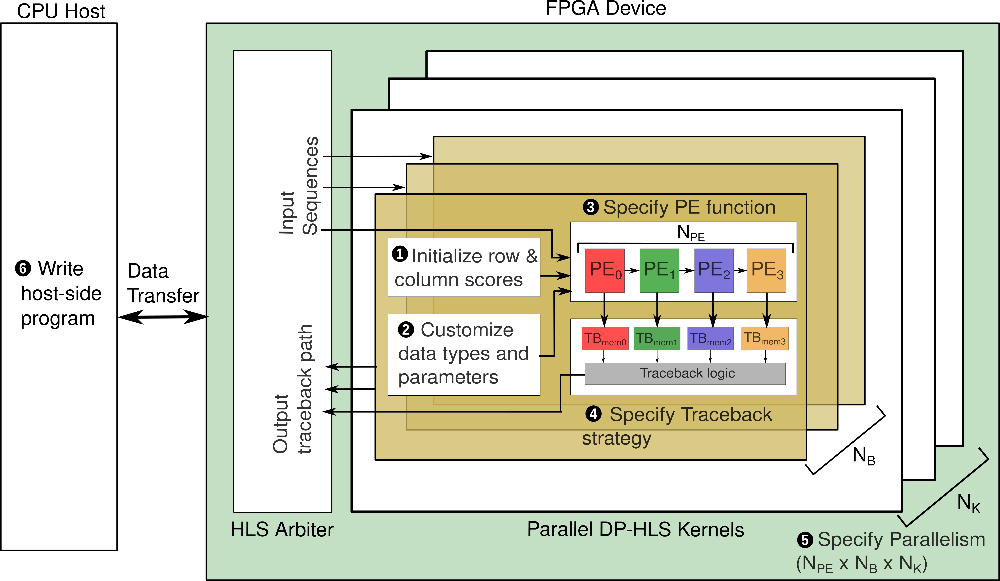

# DP-HLS: A High-Level Synthesis Framework for Accelerating Dynamic Programming Algorithms in Bioinformatics

<div align="center">


</div>

## Introduction

Welcome to the official wiki of DP-HLS. DP-HLS is a framework designed to simplify and accelerate the development of a
broad set of bioinformatically relevant DP algorithms based on the 2-D DP paradigm using High-Level Synthesis (HLS). Built with the AMD Xilinx Vitis HLS tool, DP-HLS offers extensive customizability, enabling users to create and implement FPGA-accelerated kernels tailored to their specific applications.

### 2-D Dynamic Programming Paradigm

<div align="center">



</div>

<br>

Many bioinformatics problems involve comparing linear biological sequences (DNA, RNA, proteins) to identify similarities and differences. A common approach to this problem is using 2-D dynamic programming (DP) algorithms (2-D DP paradigm), which typically consists of three steps: i) initialization, ii) matrix fill, and iii) traceback. 

The initialization step arranges the two sequences being compared on a 2-D grid, called DP matrix, with one sequence along the horizontal axis and the other along the vertical axis. The first row and column are initialized with predefined scores. Next, in the matrix fill step, a recursive formula is used to score each cell based on its three neighboring cells: above, left, and diagonal, allowing for ’gaps’ in sequences. Finally, the traceback step, which is optional in some algorithms, recovers the path in the DP matrix corresponding to the sequence of decisions giving the overall optimal score. 

### Variations in 2-D Dynamic Programming algorithms

Variations in general paradigm of 2-D Dynamic Programming has led to wide variety of algorithms used by bioinformatics tools in various applications. The table below lists some of the famous algorithms used in bioinformatics which is caused due to some variations in the scoring, initialization and traceback part of the general DP algorithmic template. These variations are described in [Customize new kernels](#customize-new-kernels) section below.

| Sl No. | Input Alphabets | Kernels                                      | State-of-the-art Tools            | Applications                        | Modifications in DP-HLS               |
|--------|-----------------|----------------------------------------------|-----------------------------------|-------------------------------------|----------------------------------------|
| 1      | DNA             | Global Linear Alignment (Needleman-Wunsch)   | BLAST, LASTZ                      | Similarity Search                   |                                        |
| 2      | DNA             | Global Affine Alignment (Gotoh)              | BLAST, LASTZ                      | Similarity Search with gaps         | Scoring                                |
| 3      | DNA             | Local Linear Alignment (Smith-Waterman)      | BLAST, FASTA, LASTZ               | Gene finding, Motif detection       | Initialization and Traceback           |
| 4      | DNA             | Local Affine Alignment (Smith-Waterman Gotoh)| BLAST, FASTA, LASTZ               | Gene finding, Motif detection       | Scoring, Initialization and Traceback  |
| 5      | DNA             | Global Two-piece Affine Alignment            | Minimap2                          | Long Read Alignment                 | Scoring                                |
| 6      | DNA             | Overlap Alignment                            | WGA Tools (CANU, Flye)            | Whole Genome Assembly               | Initialization and Traceback           |
| 7      | DNA             | Semi-global Alignment                        | BWA-MEM                           | Whole Genome Assembly               | Initialization and Traceback           |
| 8      | Seq. Profiles   | Profile Alignment                            | CLUSTALW, MUSCLE                  | Multiple Sequence Alignment         | Sequence Alphabet and Scoring          |
| 9      | Complex Nos.    | Dynamic Time Wrapping Algorithm (DTW)        | SquiggleKit                       | Basecalling                         | Sequence Alphabet and Scoring          |
| 10     | DNA             | Viterbi Algorithm (PairHMM)                  | HMMER                             | Remote Homology Search              | Scoring (no Traceback)                 |
| 11     | DNA             | Banded Local Linear Alignment                | BLAST, Bowtie                     | Fast local alignment                | Scoring and Initialization             |
| 12     | DNA             | Banded Local Affine Alignment                | Minimap2                          | Long read alignment                 | Initialization, Scoring (no Traceback) |
| 13     | DNA             | Banded Two-piece Affine Alignment            | Minimap2                          | Long read alignment                 | Scoring, Initialization and Traceback  |
| 14     | Integers        | Semi-global DTW (sDTW)                       | SquiggleFilter, RawHash           | Basecalling                         | Sequence Alphabet and Scoring          |
| 15     | Amino acids     | Local Linear Alignment with protein sequences| EMBOSS Water, BLASTp              | Protein Local Alignment             | Sequence Alphabet and Scoring          |


### DP-HLS Framework

<div align="center">



</div>

</br>

<div align="center">



</div>

The DP-HLS framework is composed of two main components: the front-end and the back-end. The front-end component allows users to specify or customize new kernels in C/C++ by modifying certain parameters and code blocks. After configuring the HLS framework to create a kernel as per your usecases, then user needs to simulate, verify and synthesize the kernel. Once done, the kernel is ready to be deployed to FPGA after incorporating the host code. The above figure depicts the various stages of the front-end design flow. 

The back-end component of the DP-HLS framework contains a fixed set of HLS directives or pragmas that provide the HLS compiler with the necessary hints to efficiently map the front-end kernel design specification into an optimized RTL implementation  to be deployed to FPGA without requiring digital design expertise. 

## Features

1. **Easy customization of algorithms**: HLS-based open-source framework streamlines the creation of FPGA accelerators for
new algorithms. To implement any custom algorithm, only the scoring functions and a few parameters need to be modified without requiring an in-depth RTL or digital design experience.
2. **Easy deployment into hardware**: The framework allows the user to implement highly customized FPGA kernels to deploy within days, whereas developing in HDL takes months.
3. **Supports complex 2-D DP based algorithms**: DP-HLS supports the creation of Viterbi Algorithm, Multiple Sequence Alignment and Dynamic Time Warping Algorithm based kernels in a common framework for the first time. 
4. **Faster kernels compared to baselines**: DP-HLS based kernel implementation showed up to 32x improvements in throughput over CPU baselines and comparable results (within XX to XX margin) to hand-crafted RTL implementations, with the added benefit of easier design configurability.

## Quick Start

To create, customize and deploy your own kernel on FPGA using DP-HLS framwork, it requires a series of steps to be executed. We have already developed pre-built templates of some of the well known algorithms listed in table 1. These pre-built templates are simulated using standard C++, synthesized using AMD Xilinx Vitis HLS 2021.1 toolchain on 8-core Amazon EC2 z1d instance and deployed on Amazon EC2 F1 instance based FPGA.

The following sections mentions the steps to quickly simulate, synthesize and deploy global affine kernel which incorporates Needleman-Wunsch algorithm with affine gap penalty. Similar steps need to be followed for other pre-built kernel templates as well. To create and execute your own custom kernel, please refer to the sections which describes all possible commands and parameters supported by DP-HLS - [Customize new kernels](#customize-new-kernels), [Build and simulate new kernels](#build-and-simulate-new-kernels) and [Synthesize and deploy new kernels](#synthesize-and-deploy-new-kernels). 

### Step 0: Create AWS instances

To use our DP-HLS framework quickly to build and run the kernels, it would be preferrable to use AWS instances which comes with the AWS FPGA Developer AMI containing AMD Xilinx Vitis 2021.2. 

### Step 1: Clone the DP-HLS repository from GitHub

The DP-HLS repo can be cloned using the following commands.

```bash
git clone https://github.com/TurakhiaLab/DP-HLS.git
```
or `ssh` to :
```bash
git clone git@github.com:TurakhiaLab/DP-HLS.git
```

### Step 2: Install the required dependencies

Please make sure the following dependencies are installed in your system.

- g++ >= 4.8.5
- Python > 3.6

### Step 3: Build and simulate the kernel

Once the repository is cloned and dependencies are installed, run the following command to build and simulate the kernel.

```bash
mkdir build && cd build
cmake ..
make global_affine 
```

### Step 4: Synthesize the kernel

Once the build is complete, you need to configure the file `config.json` under `demo/global_affine` by providing the DP-HLS folder path. This pre-configured JSON file will compile and synthesize the Global Affine kernel with `MAX_QUERY_LENGTH` and `MAX_REFERENCE_LENGTH` as 256 each along with 32 PEs, 2 Blocks, and 1 Compute Unit. The input clock frequency is set to 250 MHz. 

```json
{
    "size": {
        "max_problem_size": [
            {"max_query_length": 256, "max_reference_length": 256}
        ],
        "pe_num": [32],
        "blocks": [2],
        "cu": [1]
    },
    "kernel": {
        "name": "seq_align_multiple_static",
        "clock_frequency": 250000000
    },
    "design": {
        "path_params": "<dp_hls_root>/DP-HLS/demo/global_affine/design",
        "path_frontend": "<dp_hls_root>/demo/global_affine/design/kernel_global_affine.cpp",
        "dp-hls_root": "<dp_hls_root>",
        "host_program": "<dp_hls_root>/DP-HLS/src/hosts/host_ocl_global.cpp"
    },
    "output_path": "<dp_hls_root>/demo/global_affine/output/compile",
    "output_name": "global_affine",
    "build": {
        "build_type": "hw"
    },
    "vitis_hls": {
        "cosim_testbench": "<dp_hls_root>/DP-HLS/testbench/test_csim_global_affine.cpp",
        "output_path": "<dp_hls_root>/demo/global_affine/output/cosim",
        "export_design": 0
    }
}
```
Once the JSON file is configured as mentioned above, run the following command for compiling and synthesizing the Global Affine kernel. 

```python
python /home/centos/workspace/DP-HLS/py-hls/parallel_compile.py --config <dp_hls_root>/demo/global_affine/config.json --compile True --num_workers 1 --all True
```

After completion of this step, an `.xclbin` file will be generated which is the bitstream file, used for deploying the kernel on the FPGA device. 

<!-- !!! Note
    The `params.h` file used in the Step 3 differs from the `params.h` file used in this step. The difference is that the `params.h` used here have the kernel size related macro definitions removed to avoid conflict definition when compiling a batch of kernels with the `config.json` file, which defines the kernel size dynamically with the compile flags.  -->

### Step 5: Deploy the kernel on FPGA

Once the compilation is done and the `.xclbin` bitsteram is generated, you need to create an AFI to deploy the kernel. This can be done on any platform. However, we prefer using AWS instances which has AWS FPGA Developer AMI containing AMD Xilinx Vitis 2021.2.  

First you need to create a S3 bucket for the design checkpoint (DCP) and the logs. 

**1. Create AFI**

Execute the following commands to create an AFI for kernel deployment. 

```bash
git clone https://github.com/aws/aws-fpga.git  # Clone the AWS FPGA Repo
source aws-fpga/vitis_setup.sh     # Setup the Vitis HLS
cd <dp_hls_root>/demo/global_affine/output/compile && <aws_fpga_repo_path>/Vitis/tools/create_vitis_afi.sh -xclbin=./build_dir.hw.xilinx_aws-vu9p-f1_shell-v04261818_201920_3/seq_align_kernel.xclbin -o=./global_affine -s3_bucket=<s3_bucket_name> -s3_dcp_key=<s3_dcp_folder> -s3_logs_key=<s3_logs_folder>
```

**2. Waiting for the AFI to ready** 

You can check whether an AFI is ready using `aws ec2 describe-fpga-images --fpga-image-ids <AFI ID>`. The AFI is ready to use if the status of the code is available, as shown below. 

```json
...
"State": {
    "Code": "available"
},
...
```

**3. Run the kernel** 

You can now run the kernel on AWS F1 FPGA based instances. 

**AWS instance creation**: AWS F1 instance creation can be done with two methods. The first method is to change the instance type of the development instance to be `f1.2xlarge`. The another method is to create an EFS that are capable share files across multiple instances; then you create a new F1 instance with AWS-FPGA repo cloned in it and upload the compilation output folder to the EFS for sharing between the Development and Deployment instance. 

Once you are on the F1 instance, after you can access the compiled bitstream, you can start the kernel by running:

```bash
./dp-hls_host global_affine.awsxclbin
```

## Customize new kernels

This section mention detailed steps to create and customize your own kernel based on specific requirements. Once the kernels are customized, then it will be ready for simulation, synthesis and deployment. We also mention the details on how to build and simulate your kernel to verify the implementation in the section [Build and simulate new kernels](#build-and-simulate-new-kernels) as well as how to synthesize and deploy it on AWS F1 FPGA instances (FPGA device in which we tested our pre-built kernel templates) in the section [Synthesize and deploy new kernels](#synthesize-and-deploy-new-kernels).

### Step 1: Understanding variations in 2-D Dynamic Programming paradigm

Before starting, it is preferred to go through and understand the existing variations in 2-D DP paradigm before diving deep into the customization step. 

All kernels follow a general template for 2-D dynamic programming paradigm. However, subtle variations lead to creation of different types of algorithms for different usecases (check out algorithms and their corresponding variations listed in table 1). Some of the variations are mentioned in subsequent sections below. 

#### Variations in Initialization Step

<div align="center">


</div>

<br>

For the execution of dynamic progamming, the first row and column of the 2-D DP matrix needs to be initialized. User can provide their own initial scores for the first row and column depending on the usecases. Depending on which traceback strategy (described below) is used, the scores could be a constant (e.g., 0 or -∞) or a function of the gap penalties.

#### Variations in Traceback Step

<div align="center">


</div>

<br>

Traceback step determine the path that results in the optimal score. While the recurrence scoring equations specify the optimal transitions on a path, depending on the usecases, the traceback strategy determines where to start and end the traceback path. There are variations seen in the traceback step for mainly four categories of alignments algorithms: global, local, semi-global, and overlap. User can have their own traceback strategy depending on their requirements. 

1. Global strategy performs end-to-end comparison of sequences, with traceback starting from the bottom-right cell of the 2-D DP matrix to the top-left cell. This is commonly used when two corresponding sequences, e.g., gene sequences, are being compared. 
2. Local strategy finds the most similar subsequences and is ideally suited for identifying conserved motifs or functional regions in sequences. Here, the traceback begins from the highest-scoring cell and stops at a 0-scoring cell.
3. Semi-global strategy allows paths spanning one sequence end-to-end with a sub-sequence of the other. Here, the traceback begins from the highest-scoring cell in the bottom row of the 2-D DP matrix and continues to the top row. 
4. Overlap strategy matches sub-sequences at the beginning of one sequence and at the end of the other. This algorithm finds applications in genome assembly. Here, the traceback starts from the highest-scoring cell in the rightmost column (bottom row) of the 2-D DP matrix and continues to the top row (leftmost column).

#### Variations in Scoring Logic

<div align="center">


</div>

<br>

Scoring of the cells in the 2-D DP paradigm refers to the recurrence equations used to calculate the individual scores of cells in the 2-D grid. Equations reward matches or similarities of characters in the two sequences being compared and penalize mismatches or gaps. Several variations of scoring strategies are commonly used in bioinformatics applications as shown in the above figure. User can specify their own scoring equation for their custom algorithmic requirement. 

#### Variations in Input Alphabets

<div align="center">


</div>

<br>

An alphabet refers to the set of characters used to represent the sequences being compared, such as DNA, RNA, or protein sequences, which consists of 4 or 20 characters, although variations may exist. In DNA based kernel algorithms, sequences are represented as 4 different nucleotides, with extra N representing the ambiguous bases. Multiple sequence alignment inputs are represented as profiles which is a tuple of 5 (21) integers, referring to the frequencies of 4 nucleotides. For RNA based alignments, inputs alphabets are represented as 20 different characters corresponding to amino acids. Dynamic Time Warping based alignments, used in signal processing to compare two time-series signals, uses real or complex number values as input alphabets. 

Hence for different types of algorithms, there can be differences in types of input alphabets and their representation, provided by the user. 

### Step 2: Customize data types and parameters

Step 2-6 describes how to configure and customize your own kernel. The customization steps involve changes in few parameters as well as addition/modification of few code blocks as mentioned. Once you are aware of the variations that exists and how it leads to different algorithms (described in step 1), it will be easier to configure parameters. 

DP-HLS framework supports custom data types of all kernels with variable precision for scoring, traceback, and internal logic indices. This flexibility enables users to attain optimal computational efficiency according to the specific needs of their kernels. 

The possible datatype and parameter customization supported by DP-HLS is described in this step below.

#### 1. Modify Sequence Alphabet 

To modify the sequence alphabets of the inputs of custom kernels, define an arbitrary user-defined datatype `char_t` as follows. The example mentions a 2-bit precision integer used to define char_t. This alphabet represents the four nucleotide bases `A`,`C`,`G`,`T` within the custom kernels requiring DNA sequences as input. 

```cpp
typedef ap_uint<2> char_t;
```

To define input alphabets for Dynamic Time Warping (DTW) kernels, DP-HLS requires user to define a struct (shown below) consisting of two 32-bit fixed-point numbers to represent the real and imaginary parts of the two temporal signals (which take complex values) being compared by the kernel.

```cpp
struct char_t_st {
    ap_fixed <32,26> real, imag;
    };

typedef char_t_st char_t 
```
#### 2. Modify Scoring Layers

To design and customize a 2-D DP kernel that involves multiple recurrence equations, each computing a unique value per cell, DP-HLS provides a variable called `N_LAYERS` which configures the number of unique values computed and stored per cell of the DP matrix. 

For example, for affine-gap penalty based kernels, which uses 3 recurrence equations, `N_LAYERS` is set to 3. For two-level affine-gap penalty based kernels, set it to 5 for 5 layers of DP-matrix, each governed by one recurrence equation. 

#### 3. Modify Scoring Parameters

For a custom kernel, specify arbitrary number of scoring parameters used by the kernels, each of arbitrary data types in a C/C++ struct called `ScoringParams`. The following example shows the definition of `ScoringParams` for Global Linear Kernel which uses 3 parameters: match, mismatch and one linear gap penalty. 

```cpp
struct ScoringParams { 
    type_t mismatch;
    type_t match;
    type_t linear_gap;
} params;
```

Viterbi algorithm for pairHMMs requires three hidden states (M-Match/Mismatch, I-Insertion and D-Deletion) and a total of 27 parameters including two transition probabilities between three hidden states and 5x5 matrix storing the emission probabilities for all pairs of character (`A`,`C`,`G`,`T`) in the M states. The following example illustrates the definition of struct `ScoringParams` used for designing Viterbi Algorithm. 

```cpp
struct ScoringParams {
    type_t log_mu ;
    type_t log_lambda ;
    type_t emission [5][5];
} params ;
```

#### 4. Specify Maximum Sequence Lengths

DP-HLS requires users to set the maximum sequence lengths for the input reference and query using `MAX_REFERENCE_LENGTH` and `MAX_QUERY_LENGTH` to determine the memory sizes for storing sequences and traceback pointers on the FPGA device. This allows user to execute kernels with sequence lengths smaller than or equal to maximum configured lengths without reimplementing the kernel. 

#### 5. Specify Traceback Pointer data types and states

To specify the datatype for traceback pointers, define the datatype `tb_t` as arbitrary precision integers (`ap_uint<2>` for Global Linear Kernel and `ap_uint<4>` for Global Affine Kernel since both kernels require a 2-bit and 4-bit traceback pointer, respectively). 2-bit traceback pointer is used to point any one position out of 3 positions (up, left and diagonal) for each of the cell. Among 4-bit traceback pointer used by Global Affine, 2-bit is used for direction mentioned above. Upper 2 bits are used for choosing one layer out of three layers in affine gap penalty based kernels. 

The traceback logic in the final step of DP algorithms is equivalent to a finite state machine (FSM) in which the current state `tb_curr_state` and the traceback matrix determine the next state `tb_next_state`, and the state transitions translate to the traceback path. The users are required to enumerate the possible traceback states in the variable `TB_STATE` as shown below.

The following example enumerates three states — `MM`, `INS`, and `DEL` — in the Global Linear kernel representing the three possible states of traceback pointers based on its recurrence equation.

```cpp
enum TB_STATE {
    MM , INS , DEL
} tb_next_state, tb_curr_state ;
```

The following example shows for the Global Affine kernel, where the two additional recurrence equations for long gap scores `LONG_INS` and `LONG_DEL` (long deletion and long insertion respectively) each add a traceback state. 

```cpp
enum TB_STATE {
    MM , INS , DEL ,
    LONG_INS , LONG_DEL
} tb_next_state, tb_curr_state ;
```

#### 6. Specify Band Width (for banding kernels)

DP-HLS allows user to opt the banding search space pruning strategy in their custom kernel by setting the macro
`BANDING` to `FIXED` and `BANDWIDTH` to the desired band size. `BANDING` is set to `RECTANGULAR` by default or if no banding is needed.

### Step 3: Initialize row and column scores

Once the parameters are specified based on requirements (described in step 2), now its time to add/modify code blocks for initialization, scoring and traceback logic for your own custom kernel. This step shows how to add your own column and row initialization scores as the first step in the 2-D DP paradigm. 

To provide the initial row and column scores to the custom kernel for the initial step, specify the values of the 2-D arrays `init_row_scr` and `init_col_scr`. Each array is of dimensions `MAX_REFERENCE_LENGTH × N_LAYERS` and `MAX_QUERY_LENGTH × N_LAYERS`, respectively. The users should only specify the values of these arrays, as the DP-HLS’s back-end automatically copies them to the device at runtime.

The following example illustrates the row and column initialization of Global Linear Kernel. It has a single scoring layer at index 0 whose first row and column are initialized to account for gaps at the start of the alignment.

```cpp
type_t gap = scoring_params.linear_gap ;
for ( int i = 0; i < MAX_REFERENCE_LENGTH ; i ++) {
    init_row_scr [ i ][0] = i * gap ; }
for ( int i = 0; i < MAX_QUERY_LENGTH ; i ++) {
    init_col_scr [ i ][0] = i * gap ; }
```

### Step 4: Specify Scoring function

The second step after initialization is the scoring of the DP matrix. To execute this step, user needs to provide their own recurrence equations to be executed by each Processing Elements (PE) and filled up in each of the cells of the DP matrix. 

Specify the recurrence equations for computing the score
and traceback pointer for a single cell (i, j), located at row
i and column j of the DP matrix, in a specific function, `PE_func`. 

The following example code shows the scoring equations computed by PEs for the Local Linear kernel. The arrays `dp_mem_up`, `dp_mem_diag`, and `dp_mem_left`, are the inputs to `PE_func` and populated with cell scores automatically by the DP-HLS backend for cells at positions up (i-1, j), diagonal (i-1, j-1) and left (i, j-1) of the current cell (i, j). Likewise, the i𝑡h query character and the j𝑡ℎ reference character are also automatically available to the input of `PE_func` as `lc_qry_val` and `lc_ref_val`, respectively. At the end of the function call, valid scores and traceback pointers for cell (i, j) must be stored to `wt_scr` and `wt_tbp`.

```cpp
// Inside Local Linear PE_func
// Compute the upper , left , and diagonal scores

type_t linear_gap = params . linear_gap ;
type_t ins = dp_mem_left [0] + linear_gap ;
type_t del = dp_mem_up [0] + linear_gap ;
type_t match = dp_mem_diag [0] + ( lc_qry_val == lc_ref_val ) ? params . match : params . mismatch ;
```

```cpp
// determine the maximum value and traceback

type_t max_value = ins ;
wt_tbp = TB_LEFT ;

if ( max_value < match ) { max_value = match ;
    wt_tbp = TB_DIAG ; 
    }
if ( max_value < del ) { max_value = del ;
    wt_tbp = TB_UP ; 
    }
if ( max_value < ( type_t ) 0) { max_value = 0;
    wt_tbp = TB_END ; 
    }

wt_scr = max_value ;
```

### Step 5: Specify Traceback Strategy

The third step after initialization and scoring logic modification of your own custom kernel is to specify the traceback logic/strategy.

Each score matrix cell is mapped to a state, and state transitions correspond to jumps between scoring matrices. User needs to define the logic to map the current cell’s state and its traceback pointer to the next cell which is called at every traceback step. 

In the Local Linear kernel example with a single state shown below, the outer if-statement checks the current state from the `tb_state` and assigns the new state. The traceback write-out port `wt_tbp` is assigned a direction to move in the score matrix, corresponding to insertion, deletion, match/mismatch, or end of the traceback.

```cpp
if ( tb_state == TB_STATE :: MM ) {
    if ( tb_ptr == TB_DIAG ) { tb_move = AL_MMI ; 
    }
    else if ( tb_ptr == TB_UP ) { tb_move = AL_DEL ; 
    }
    else if ( tb_ptr    == TB_LEFT ) { tb_move = AL_INS ;
    }
    else if ( tb_ptr == TB_END ) { tb_move = AL_END ;
    }
    else { tb_move = AL_END ; 
    }

tb_state = TB_STATE :: MM ;
}
```

### Step 6: Specify Parallelism

Each kernel in DP-HLS consists of NB blocks, which concurrently execute distinct pairs of input sequences, each having NPE number of PEs. These blocks are identical in terms of hardware implementation, ensuring uniform performance across all blocks. To exploit the resources for maximum throughput, DP-HLS allows multiple blocks to be executed in single hardware device. DP-HLS also allows user to integrate and execute different types of kernels (Nk number of heterogenous kernels), each having NB blocks. 

The parameter NPE determines the level of inner-loop parallelism for a single pair of sequences. DP-HLS also exploits outer-loop parallelism across multiple sequence pairs by setting the parameters NB and NK.

The values of NPE, NB and NK are all customizable by the users. 

## Build and simulate new kernels

Once the kernels are customized based on your own specific requirement, then its time to build and simulate it to verify the changes. The C-Simulation or C based simulation of the customized kernel is performed with CMake, since it enables standard C++ debugging processes and the debuggers. 

!!! Note
    Vitis HLS also supports the C-Simulation step which uses `v++` compiler. However, we found the standard `c++` compiler to have much smaller latency in rebuilding the kernel and rerun the debugger than using the Vitis HLS.

### Step 1: Install Dependencies

To build and simulate the kernel, it is required to have `g++ (GCC) >= 4.8.5` and `CMake3` installed in your system. 

!!! Note
    If you have older version of CMake in your system, you need to install CMake3 and set it to default instead. You could follow this useful [StackOverflow post](https://stackoverflow.com/questions/48831131/cmake-on-linux-centos-7-how-to-force-the-system-to-use-cmake3) to perform this step.

### Step 2: Create a testbench

For the basic C based simulation of the customized kernel, user needs to create a simple testbench to drive the kernel at this step. A testbench should consists of the buffer and input initialization, kernel call, and output verification. Please refer to the following code for the testbench example of Global Affine kernel. Notice that you can write a similar C++ function to verify the correctness of the kernel output. 

<style>
.scrollable-code {
    max-height: 300px; /* Adjust the height as needed */
    overflow-y: auto;
}
</style>

<div class="scrollable-code">

```cpp
#include <string>
#include <vector>
#include <array>
#include <map>
#include <chrono>
#include "params.h"
#include "seq_align_multiple.h"
#include "host_utils.h"
#include "solutions.h"
#include "debug.h"

using namespace std;

#define INPUT_QUERY_LENGTH 256
#define INPUT_REFERENCE_LENGTH 256

char_t base_to_num(char base)
{
    switch (base)
    {
    case 'A':
        return 0;
    case 'C':
        return 1;
    case 'G':
        return 2;
    case 'T':
        return 3;
    default:
        return 0;
#ifdef CMAKEDEBUG
        throw std::runtime_error("Unrecognized Nucleotide " + std::string(1, base) + " from A, C, G, and T.\n"); // or throw an exception
#endif
    }

}

struct Penalties_sol
{
    float extend;
    float open;
    float linear_gap;
    float match;
    float mismatch;
};

int main(){
    char alphabet[4] = {'A', 'T', 'G', 'C'};
    std::string query_string = Random::Sequence<4>(alphabet, INPUT_QUERY_LENGTH);
    std::string reference_string = Random::Sequence<4>(alphabet, INPUT_REFERENCE_LENGTH);

    // Struct for Penalties in kernel
    Penalties penalties[N_BLOCKS];
    for (int i = 0; i < N_BLOCKS; i++){
        penalties[i].extend = -1;
        penalties[i].open = -1;
        penalties[i].match = 3;
        penalties[i].mismatch = -1;
    }

    // Struct for penalties in solution
    Penalties_sol penalties_sol[N_BLOCKS];
    for (Penalties_sol &penalty : penalties_sol) {
        penalty.extend = -1;
        penalty.open = -1;
        penalty.match = 3;
        penalty.mismatch = -1;
    }

    // Reference and Query Strings
    std::vector<char> query(query_string.begin(), query_string.end());
    std::vector<char> reference(reference_string.begin(), reference_string.end());
 
#ifdef CMAKEDEBUG
    // Initialize Debugger
    Container debuggers[N_BLOCKS];
    for (int i = 0; i < N_BLOCKS; i++){
        debuggers[i] = Container();
    }
#endif

    // Assert actual query length and reference length should be smaller than the maximum length
    try {
        if (query.size() > MAX_QUERY_LENGTH) throw std::runtime_error("Query length should less than MAX_QUERY_LENGTH, "
            "actual query len " + std::to_string(query.size()) + ", Allocated qry len: " + std::to_string(MAX_QUERY_LENGTH));
        if (reference.size() > MAX_REFERENCE_LENGTH) throw std::runtime_error("Reference length should less than MAX_REFERENCE_LENGTH, "
            "actual ref len " + std::to_string(reference.size()) + ", Allocated ref len: " + std::to_string(MAX_REFERENCE_LENGTH));
    } catch (const std::exception &e) {
        std::cerr << "Exception: " << e.what() << std::endl;
        throw;
    }

    // Allocate query and reference buffer to pass to the kernel
    char_t reference_buff[MAX_REFERENCE_LENGTH][N_BLOCKS];
    char_t query_buff[MAX_QUERY_LENGTH][N_BLOCKS];

    // Allocate lengths for query and reference
    idx_t qry_lengths[N_BLOCKS], ref_lengths[N_BLOCKS];

    // Fill query buffer and references buffer for all blocks.
    // Each buffer is of MAX size, but only the actual length
    // elements is filled.
    for (int b = 0; b < N_BLOCKS; b++)
    {
        for (int i = 0; i < query.size(); i++)
        {
            query_buff[i][b] = base_to_num(query[i]);
        }
        for (int i = 0; i < reference.size(); i++)
        {
            reference_buff[i][b] = base_to_num(reference[i]);
        }
    }

    // Fill the lengths of the query and reference
    for (int b = 0; b < N_BLOCKS; b++)
    {
        qry_lengths[b] = query.size();
        ref_lengths[b] = reference.size();
    }

    // Allocate traceback streams
    tbr_t tb_streams[MAX_REFERENCE_LENGTH + MAX_QUERY_LENGTH][N_BLOCKS];

    // initialize traceback starting coordinates
    idx_t tb_is[N_BLOCKS];
    idx_t tb_js[N_BLOCKS];

    cout << "Kernel Started" << endl;
    // Actual kernel calling
    seq_align_multiple_static(
        query_buff,
        reference_buff,
        qry_lengths,
        ref_lengths,
        penalties,
        tb_is, tb_js,
        tb_streams
#ifdef CMAKEDEBUG
        , debuggers
#endif
        );
    
    // Print the query and reference strings
    cout << "Query    : " << query_string << endl;
    cout << "Reference: " << reference_string << endl;

    // Get the solution scores and traceback
    array<array<array<float, MAX_REFERENCE_LENGTH>, MAX_QUERY_LENGTH>, N_LAYERS> sol_score_mat;
    array<array<string, MAX_REFERENCE_LENGTH>, MAX_QUERY_LENGTH> sol_tb_mat;
    map<string, string> alignments;
    auto sol_start = std::chrono::high_resolution_clock::now();
    global_affine_solution<Penalties_sol, MAX_QUERY_LENGTH, MAX_REFERENCE_LENGTH, N_LAYERS>(query_string, reference_string, penalties_sol[0], sol_score_mat, sol_tb_mat, alignments);
    auto sol_end = std::chrono::high_resolution_clock::now();
    // print_matrix<float, MAX_QUERY_LENGTH, MAX_REFERENCE_LENGTH>(sol_score_mat[0], "Solution Score Matrix Layer 0");
    // print_matrix<char, MAX_QUERY_LENGTH, MAX_REFERENCE_LENGTH>(sol_tb_mat, "Solution Traceback Matrix");
    cout << "Solution Aligned Query    : " << alignments["query"] << endl;
    cout << "Solution Aligned Reference: " << alignments["reference"] << endl;
    // Display solution runtime
    std::cout << "Solution Runtime: " << std::chrono::duration_cast<std::chrono::milliseconds>(sol_end - sol_start).count() << "ms" << std::endl;

#ifdef CMAKEDEBUG
    // Cast kernel scores to matrix scores
    debuggers[0].cast_scores();
    // print_matrix<float, MAX_QUERY_LENGTH, MAX_REFERENCE_LENGTH>(debuggers[0].scores_cpp[0], "Kernel 0 Scores Layer 0");
    debuggers[0].compare_scores(sol_score_mat, query.size(), reference.size());  // check if the scores from the kernel matches scores from the solution
#endif

    // reconstruct kernel alignments
    array<map<string, string>, N_BLOCKS> kernel_alignments;
    int tb_query_lengths[N_BLOCKS];
    int tb_reference_lengths[N_BLOCKS];
    string query_string_blocks[N_BLOCKS];
    string reference_string_blocks[N_BLOCKS];
    // for global alignments, adjust the lengths to be the lengths - 1
    for (int i = 0; i < N_BLOCKS; i++) {
        tb_query_lengths[i] = (int) tb_is[i];
        tb_reference_lengths[i] = (int) tb_js[i];
        query_string_blocks[i] = query_string;
        reference_string_blocks[i] = reference_string;
    }
    tbr_t tb_streams_host[N_BLOCKS][MAX_REFERENCE_LENGTH + MAX_QUERY_LENGTH];
    HostUtils::IO::SwitchDimension(tb_streams, tb_streams_host);
    kernel_alignments = HostUtils::Sequence::ReconstructTracebackBlocks<tbr_t, N_BLOCKS, MAX_QUERY_LENGTH, MAX_REFERENCE_LENGTH>(
        query_string_blocks, reference_string_blocks,
        tb_query_lengths, tb_reference_lengths, 
        tb_streams_host);

    // Print kernel 0 traceback
    for (int i = 0; i < N_BLOCKS; i++) {
        cout << "Kernel " << i << " Traceback" << endl;
        cout << "Kernel   Aligned Query    : " << kernel_alignments[0]["query"] << endl;
        cout << "Kernel   Aligned Reference: " << kernel_alignments[0]["reference"] << endl;
    }
}
```

</div>

!!! Note
    This testbench is for the purpose of C simulation only and is different from the OpenCL based Host program mentioned later which is needed for the actual deployment of the kernel on FPGA.
 
### Step 3: Build and Run

Once dependencies are installed, you need to edit the `CMakeLists.txt` provided in the GitHub repository for your own kernel target. 

For each target, you need to add the lines specifying the following:

1. Common source file - `COMMON_SRCS` that is required for all the kernels. 
2. Testbench file. 
3. User defined function source. 

Then you need to add the folder containing `params.h` as a include path for your kernel. The following example shows how it should be done for global affine kernel. These lines need to be added in the `CMakeLists.txt`. Similarly, you need to do it for your own custom kernel. 

```cmake
add_executable(test_csim_global_affine
    "testbench/test_csim_global_affine.cpp"
    "kernels/global_affine/kernel_global_affine.cpp"
    ${COMMON_SRCS})

target_include_directories(test_csim_global_affine PRIVATE "./kernels/global_affine")
```

Once the `CMakeLists.txt` is configured, follow the below commands to build and run the target (i.e, your own custom kernel).

```bash
mkdir build && cd build
cmake ..
make <target> ## here the target is the kernel found in the CMakeLists.txt
``` 

!!! Note
    With the CMake extension, VSCode automatically detect and configure the CMake project with the `CMakeLists.txt` provided in the repo. You can simply use the VSCode CMake extension GUI to build and run the project. 

!!! Note
    Kernels in DP-HLS framework are tested on CentOS7 with AMD Xilinx Vitis 2021.2, the OS and toolchain which comes with the AWS FPGA Developer AMI. We would suggest this platform to build and run the DP-HLS kernels because it comes with the device license in AMD Xilinx Vitis and Vivado for the FPGA device on AWS F1 instances. 
    
    If you are not using the specified AMI, then you need to set the `HLS_HOME` variable in `CMakeLists.txt` to point to the customized Vitis HLS installation path so CMake can find the correct include and link path. 

## Synthesize and deploy new kernels

### Step 1: Write host-side program
In addition to the `params.h` and your kernel function source file, you need to write a OpenCL host program to synthesize and deploy the kernel. A simple example for the host program can be found in the [Vitis Examples](https://github.com/Xilinx/Vitis_Accel_Examples/blob/f61637e9263ecc1be3df34182ea6c53a0ca10447/hello_world/src/host.cpp).

The following code shows a sample host program for your reference.

<style>
.scrollable-code {
    max-height: 300px; /* Adjust the height as needed */
    overflow-y: auto;
}
</style>

<div class="scrollable-code">

```cpp

#include "xcl2.hpp"
#include <vector>
#include <algorithm>
#include <ap_int.h>
#include <ap_fixed.h>
#include "../../include/host_utils.h"
#include "dp_hls_common.h"
#include <map>
#include <chrono>

int base_to_num(char base){
    switch (base)
    {
    case 'A':
        return 0;
    case 'C':
        return 1;
    case 'G':
        return 2;
    case 'T':
        return 3;
    default:
        return 0;
#ifdef CMAKEDEBUG
        throw std::runtime_error("Unrecognized Nucleotide " + std::string(1, base) + " from A, C, G, and T.\n"); // or throw an exception
#endif
    }
}


int main(int argc, char **argv) {
    if (argc != 2) {
        std::cout << "Usage: " << argv[0] << " <XCLBIN File>" << std::endl;
        return EXIT_FAILURE;
    }

    std::string binaryFile = argv[1];
    cl_int err;
    cl::Context context;
    cl::Kernel krnl_seq_align;
    cl::CommandQueue q;

    // Allocate memory for each array
    std::vector<char_t, aligned_allocator<char_t>> querys(N_BLOCKS * MAX_QUERY_LENGTH);
    std::vector<char_t, aligned_allocator<char_t>> references(N_BLOCKS * MAX_REFERENCE_LENGTH);
    std::vector<idx_t, aligned_allocator<idx_t>> query_lengths(N_BLOCKS);
    std::vector<idx_t, aligned_allocator<idx_t>> reference_lengths(N_BLOCKS);
    std::vector<Penalties, aligned_allocator<Penalties>> penalties(N_BLOCKS); // Assuming a single penalties struct
    std::vector<idx_t, aligned_allocator<idx_t>> traceback_start_is(N_BLOCKS);  // Allocate buffer for the starting row and column of the buffer
    std::vector<idx_t, aligned_allocator<idx_t>> traceback_start_js(N_BLOCKS);
    std::vector<tbr_t, aligned_allocator<tbr_t>> tb_streams(N_BLOCKS * (MAX_REFERENCE_LENGTH + MAX_QUERY_LENGTH));

    // Initialize data
    char alphabet[] = {'A', 'T', 'C', 'G'};  // currently putting just random sequence here
    string querys_strings = Random::Sequence<4>(alphabet, N_BLOCKS * MAX_QUERY_LENGTH);
    string references_strings = Random::Sequence<4>(alphabet, N_BLOCKS * MAX_REFERENCE_LENGTH);
    const char *query_ptr = querys_strings.c_str();
    const char *reference_ptr = references_strings.c_str();
    for (int i = 0; i < N_BLOCKS; i++) {
        query_lengths[i] = MAX_QUERY_LENGTH;
        reference_lengths[i] = MAX_REFERENCE_LENGTH;
        for (int j = 0; j < MAX_QUERY_LENGTH; j++) {
            querys[i * MAX_QUERY_LENGTH + j] = (type_t) base_to_num(*query_ptr++);
        }
        for (int j = 0; j < MAX_REFERENCE_LENGTH; j++) {
            references[i * MAX_REFERENCE_LENGTH + j] = (type_t) base_to_num(*reference_ptr++);
        }
        // Initialize Penalties
        penalties[i].open = type_t(-2);
        penalties[i].extend = type_t(-1);
        penalties[i].mismatch = type_t(-3);
        penalties[i].match = type_t(2);
        penalties[i].linear_gap = type_t(-1);
    }

    // OPENCL HOST CODE AREA START
    auto devices = xcl::get_xil_devices();
    auto fileBuf = xcl::read_binary_file(binaryFile);
    cl::Program::Binaries bins{{fileBuf.data(), fileBuf.size()}};
    bool valid_device = false;
    for (unsigned int i = 0; i < devices.size(); i++) {
        auto device = devices[i];
        OCL_CHECK(err, context = cl::Context(device, nullptr, nullptr, nullptr, &err));
        OCL_CHECK(err, q = cl::CommandQueue(context, device, CL_QUEUE_PROFILING_ENABLE, &err));
        std::cout << "Trying to program device[" << i << "]: " << device.getInfo<CL_DEVICE_NAME>() << std::endl;
        cl::Program program(context, {device}, bins, nullptr, &err);
        if (err != CL_SUCCESS) {
            std::cout << "Failed to program device[" << i << "] with xclbin file!\n";
        } else {
            std::cout << "Device[" << i << "]: program successful!\n";
            OCL_CHECK(err, krnl_seq_align = cl::Kernel(program, "seq_align_multiple_static", &err));
            valid_device = true;
            break;
        }
    }
    if (!valid_device) {
        std::cout << "Failed to program any device found, exit!\n";
        exit(EXIT_FAILURE);
    }

    // Allocate Buffers in Global Memory and set kernel arguments
    OCL_CHECK(err, cl::Buffer buffer_querys(context, CL_MEM_USE_HOST_PTR | CL_MEM_READ_ONLY, 
                                            sizeof(char_t) * querys.size(), querys.data(), &err));
    OCL_CHECK(err, cl::Buffer buffer_references(context, CL_MEM_USE_HOST_PTR | CL_MEM_READ_ONLY, 
                                                sizeof(char_t) * references.size(), references.data(), &err));
    OCL_CHECK(err, cl::Buffer buffer_query_lengths(context, CL_MEM_USE_HOST_PTR | CL_MEM_READ_ONLY, 
                                                   sizeof(idx_t) * query_lengths.size(), query_lengths.data(), &err));
    OCL_CHECK(err, cl::Buffer buffer_reference_lengths(context, CL_MEM_USE_HOST_PTR | CL_MEM_READ_ONLY, 
                                                       sizeof(idx_t) * reference_lengths.size(), reference_lengths.data(), &err));
    OCL_CHECK(err, cl::Buffer buffer_penalties(context, CL_MEM_USE_HOST_PTR | CL_MEM_READ_ONLY, 
                                               sizeof(Penalties) * penalties.size(), penalties.data(), &err));
    OCL_CHECK(err, cl::Buffer buffer_traceback_start_is(context, CL_MEM_USE_HOST_PTR | CL_MEM_WRITE_ONLY,  
                                                   sizeof(idx_t) * traceback_start_is.size(), traceback_start_is.data(), &err));
    OCL_CHECK(err, cl::Buffer buffer_traceback_start_js(context, CL_MEM_USE_HOST_PTR | CL_MEM_WRITE_ONLY, 
                                                       sizeof(idx_t) * traceback_start_js.size(), traceback_start_js.data(), &err));
    OCL_CHECK(err, cl::Buffer buffer_tb_streams(context, CL_MEM_USE_HOST_PTR | CL_MEM_WRITE_ONLY, 
                                                sizeof(tbr_t) * tb_streams.size(), tb_streams.data(), &err));
                                                

    // Set Kernel Arguments
    OCL_CHECK(err, err = krnl_seq_align.setArg(0, buffer_querys));
    OCL_CHECK(err, err = krnl_seq_align.setArg(1, buffer_references));
    OCL_CHECK(err, err = krnl_seq_align.setArg(2, buffer_query_lengths));
    OCL_CHECK(err, err = krnl_seq_align.setArg(3, buffer_reference_lengths));
    OCL_CHECK(err, err = krnl_seq_align.setArg(4, buffer_penalties));
    OCL_CHECK(err, err = krnl_seq_align.setArg(5, buffer_traceback_start_is));
    OCL_CHECK(err, err = krnl_seq_align.setArg(6, buffer_traceback_start_js));
    OCL_CHECK(err, err = krnl_seq_align.setArg(7, buffer_tb_streams));

    // Copy input data to device global memory
    auto start = std::chrono::high_resolution_clock::now();
    OCL_CHECK(err, err = q.enqueueMigrateMemObjects({buffer_querys, buffer_references, buffer_query_lengths, 
                                                     buffer_reference_lengths, buffer_penalties}, 0 /* 0 means from host*/));

    // Launch the Kernel
    OCL_CHECK(err, err = q.enqueueTask(krnl_seq_align));
    

    // Copy Result from Device Global Memory to Host Local Memory
    OCL_CHECK(err, err = q.enqueueMigrateMemObjects({buffer_traceback_start_is, buffer_traceback_start_js, buffer_tb_streams}, CL_MIGRATE_MEM_OBJECT_HOST));
    q.finish();
    auto end = std::chrono::high_resolution_clock::now();
    
    // OPENCL HOST CODE AREA END

    // Print raw traceback pointer streams
    for (int i = 0; i < N_BLOCKS; i++) {
        std::cout << "Query: " << querys_strings.substr(i * MAX_QUERY_LENGTH, MAX_QUERY_LENGTH) << std::endl;
        std::cout << "Reference: " << references_strings.substr(i * MAX_REFERENCE_LENGTH, MAX_REFERENCE_LENGTH) << std::endl;
        std::cout << "Traceback: " << std::endl;
        for (int j = 0; j < MAX_QUERY_LENGTH + MAX_REFERENCE_LENGTH; j++) {
            std::cout << tb_streams[i * (MAX_QUERY_LENGTH + MAX_REFERENCE_LENGTH) + j];
        }
        std::cout << std::endl;
    }

    // Print time
    std::cout << "Kernel execution time: " << std::chrono::duration_cast<std::chrono::milliseconds>(end - start).count() << "ms" << std::endl;

    std::cout << "Kernel execution complete." << std::endl;
    return EXIT_SUCCESS;
}
```

</div> 

### Step 2: Install Dependencies

We have provided some scripts to run the synthesis and cosimulation of the kernels. For that, you need to have `Python: Version > 3.6` installed in your system. 

Kernels in DP-HLS framework are tested on CentOS7 with AMD Xilinx Vitis 2021.2, the OS and toolchain which comes with the AWS FPGA Developer AMI. 
You can use any AWS machine to synthesis the kernel as long as it's compatible with the FPGA developer AMI. We used 8-core Amazon EC2 z1d instances for the implementation of DP-HLS kernel.

### Step 3: Configure the project using JSON file

We provide a set of Python scripts with the DP-HLS repository to streamline the AMD Xilinx Vitis HLS project creation, synthesis, and implementation. Those scripts are in the `py-hls` folder. 

Those scripts require JSON configuration file as input. Following example shows how to configure the JSON file with the explanation of all parameters. This JSON file below has prefilled parameters for the global affine kernel. Similarly, you need to do it for your own custom kernel.

```json
{
    "size": {
        "max_problem_size": [
            {"max_query_length": 256, "max_reference_length": 256}
        ],
        "pe_num": [4, 8, 16, 32],
        "blocks": [1],
        "cu": [1]
    },
    "kernel": {
        "name": "seq_align_multiple_static",
        "clock_frequency": 250000000
    },
    "design": {
        "path_params": "/home/centos/workspace/DP-HLS/compile_configs/global_affine/design",
        "path_frontend": "/home/centos/workspace/DP-HLS/compile_configs/global_affine/design/kernel_global_affine.cpp",
        "dp-hls_root": "/home/centos/workspace/DP-HLS",
        "host_program": "/home/centos/workspace/DP-HLS/src/hosts/host_ocl_global.cpp"
    },
    "output_path": "/home/centos/workspace/DP-HLS/synthesis/results/global_affine",
    "output_name": "global_affine_inlined",
    "build": {
        "build_type": "hw"
    },
    "vitis_hls": {
        "cosim_testbench": "/home/centos/workspace/DP-HLS/testbench/test_csim_global_affine.cpp",
        "output_path": "/home/centos/workspace/DP-HLS/vitis_projects/global_affine",
        "export_design": 0
    }
}
```
#### JSON Parameters Explained
- `size`: Related to the size of the kernel. 
	- `max_problem_size`: Defines the `MAX_QUERY_LENGTH` and `MAX_REFERENCE_LENGTH`. 
	- `pe_num`: Number of PE in a block. 
	- `blocks`: Number of blocks in a kernel. 
	- `cu`: Number of compute units linked in a FPGA bitsteram. 
- `kernel`: Related to the kernel name and clock frequency. 
	- `name`: This sets the name of your custom kernel. Currently the name `seq_align_mulitple_static` is supported. 
	- `clock_frequency`: This sets the target clock frequency. If the design can't meet this clock frequency, then it will be lowered automatically in the kernel linking stage.
- `design`:
	- `path_params`: Specifies the path to the folder containing the `params.h`. 
    - `path_frontend`: Specifies the path to the front-end kernel source file. In this case, it points to `kernel_global_affine.cpp`.
    - `dp-hls_root`: Defines the root directory of the DP-HLS library. 
    - `host_program`: Points to the source file of the OpenCL host program that manages kernel execution on the FPGA.
- `output_path`: Specifies the output directory for generated RTL code, reports, and log files. 
- `output_name`: Defines the base name for the output files generated during the synthesis process. In this example, the output files will be prefixed with `global_affine_inlined`.
- `build`: Related to the build configuration for the Vitis project. The `build_type` can be `sw_emu`, `hw_emu`, or `hw` which is equivalent to the three `TARGETS` described in the [`aws-fpga` repo](https://github.com/aws/aws-fpga/tree/master/Vitis). 
- `vitis_hls`: Contains settings specific to using the Vitis HLS toolchain.
    - `cosim_testbench`: Specifies the path to the C++ testbench file used for co-simulation.
    - `output_path`: Indicates the output directory of the Vitis HLS project. This is separate from the bitstream output path specified in the `output_path` above. 
    - `export_design`: A flag indicating whether the design should be exported after synthesis. A value of `0` means the design will not be exported, while `1` would run the implementation and gives the post-route utilization number.

With the JSON config file above, you can compile a batch of kernels with the full combinations of `max_problem_size` x `pe_num` x `blocks` x `kernels` with the naming convention `<name>_<max_query_length>_<max_reference_length>_<pe_num>_<blocks>_<kernels>` in the output directory. For example, if the `size` is: 
```json
"size": {
	"max_problem_size": [
		{"max_query_length": 256, "max_reference_length": 256}
	],
	"pe_num": [16, 32],
	"blocks": [8, 16],
	"cu": [1]
}
```
Then the output director would contains the following folders, each one containing everything compile-related for that specific kernel configuration:
```
output_dir/                      
├── global_affine_256_256_16_8_1
├── global_affine_256_256_16_16_1
├── global_affine_256_256_32_8_1
└── global_affine_256_256_32_16_1
```

### Step 4: Synthesize the kernel

To run the python script which streamline the AMD Xilinx Vitis HLS project creation, synthesis, and implementations, run the following command:

```bash
python py-hls/auto_cosim.py --config <path_to_the_json_config> --simulate True
```

#### Explaining command-line arguments
- `--config`: Specify the path of the configured JSON file
- `--simulate`: Set to `True` if you need to perform the co-simulation step along with the synthesis step of the Vitis HLS design flow. Set to `False` if only synthesis step is needed to be performed.

### Step 4: Analyze the implementation output

After executing the python script which perform synthesis and co-simulation step of the Vitis HLS design flow, several output files will be created. Following shows the file structure for all the output files saved in the output directory for the global affine kernel (some non-essential files are not shown here).
```
output_dir/                      
├── global_affine_256_256_16_8_1/                 
│   ├── _x.hw.xilinx_aws-vu9p-f1_shell-v04261818_201920_3/
│   ├── build_dir.hw.xilinx_aws-vu9p-f1_shell-v04261818_201920_3/
│   ├── report/  
|	├── dp-hls-host
|	├── Makefile
|	├── parallel_compile_error.log         
│   └── parallel_compile_output.log
├── global_affine_256_256_16_16_1
├── global_affine_256_256_32_8_1
└── global_affine_256_256_32_16_1
```

#### Details of the output files generated

- `build_dir.hw.xilinx_aws-vu9p-f1_shell-v04261818_201920_3` contains the output `.xclbin` bitstream file, which later on needed to be used to create the AFI. 
- Detailed synthesis and implementation report (place and route) as well as the logs can be found under `_x.hw.xilinx_aws-vu9p-f1_shell-v04261818_201920_3`.
	- Detailed Synthesis Report found in: `_x.hw.xilinx_aws-vu9p-f1_shell-v04261818_201920_3/seq_align_kernel/seq_align_multiple_static/seq_align_multiple_static/solution/syn/report`
	- Synthesized Verilog source file found in: `_x.hw.xilinx_aws-vu9p-f1_shell-v04261818_201920_3/seq_align_kernel/seq_align_multiple_static/seq_align_multiple_static/solution/impl/verilog`
	- Logs found in: `_x.hw.xilinx_aws-vu9p-f1_shell-v04261818_201920_3/logs`
- `report` folder contains synthesis and place and route summary. 
- `Makefile` contains the the original make file used to compile the kernel. 
- `parallel_compile_error.log` contains the compile error collected from the `stderr` for this specific kernel. 
- `parallel_compile_output.log` contains the compile output collected from the `stdout` for this specific kernel. 

#### Analyze the output using GUI

To inspect the reports of Vitis HLS Co-Simulation and Implementation visually using GUI, please open Vitis HLS GUI and select "open project" to open the folder `global_affine_256_256_16_8_1` under the path specified for `vitis_hls/output_path` in the config (different from the compile output path). 

TBD

### Step 5: Generate the bitstream

Once the kernel is synthesized and co-simulated, run the following command to generate the bitstream: 
```bash
python py-hls/parallel_compile.py --config <path_to_the_json_config> --compile True --num_workers <workers> --all True
```
The flags for this script is explained below: 

- `config`: Specify the path to the JSON configuration file mentioned above.
- `compile`: Specify whether to compile the project or not. If set to `False`, only the Makefile is created. 
- `num_workers`: Specify the number of parallel compilation jobs when compiling for a batch of different kernel configs. The number depends on the available device resources. Too many parallel jobs would result in some kernel's compilation killed. 
- `all`: Specify whether to compile everything for the kernel or not, including the host and the kernel. If set to `False`, then only the host is compiled. If set to `True`, then both host and kernel is compiled.

!!! Note
    The compilation could take very long time, and you can verify the progress of the kernel compilation by inspecting the `v++` log file. Normally the compilation are put to the background, `tmux` perferrably. 

### Step 6: Deploy the kernel on AWS F1 FPGA

With the `.xclbin` bitstream file generated and the host program written (mentioned in step 1), your custom kernel is now ready to be deployed. 

If the custom kernels' bitstream and the host program are built on another system/AWS instance other than AWS F1 FPGA instance, you can share those files with the AWS F1 instance through [EFS](https://aws.amazon.com/efs/). 

Once the bitstream is available on AWS F1 FPGA instance, follow the following steps for the deployment. This standard process is also well described in the [Step 2 in Vitis Section of the AWS FPGA repo](https://github.com/aws/aws-fpga/tree/master/Vitis#2-create-an-amazon-fpga-image-afi). 

1. Create an F1 instance with the AWS FPGA Developer AMI. 
2. Create AFI then wait until it's status is ready. 
3. Run the kernel by calling the OpenCL host and pass-in the `.awsxclbin` bitstream. 

## Source Code Documentation
To refer to the details of the source code for using the DP-HLS framework efficiently, please refer to [Source Code Documentation](./doxygen/html/index.html)

## Contributions

We welcome contributions from the community. If you encounter any issues or have suggestions for improvement, please open an issue on GitHub. For general inquiries and support, reach out to our team.


## Citing DP-HLS

If you use DP-HLS in your research or publications, please cite the following paper: