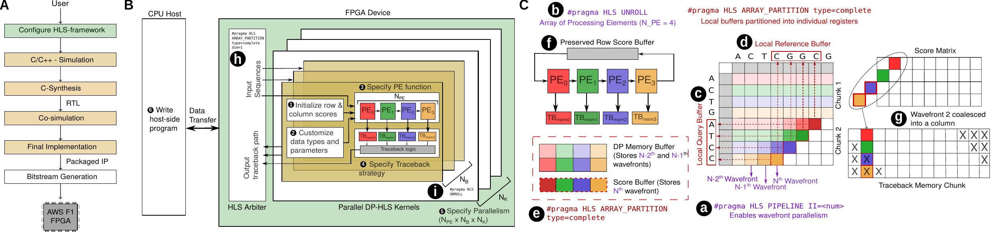

# DP-HLS: A High-Level Synthesis Framework for Accelerating Dynamic Programming Algorithms in Bioinformatics

<div align="center">


</div>

## Introduction

Welcome to the official Wiki of DP-HLS. DP-HLS is a framework designed to simplify and accelerate the development of a
broad set of bioinformatically relevant DP algorithms based on the 2-D DP paradigm using High-Level Synthesis (HLS). Built with the AMD Xilinx Vitis HLS tool, DP-HLS offers extensive customizability, enabling users to create and implement FPGA-accelerated kernels tailored to their specific applications.

## Features

1. **Easy customization of algorithms**: HLS-based open-source framework streamlines the creation of FPGA accelerators for
new algorithms. To implement any custom algorithm, only the scoring functions and a few parameters need to be modified without requiring an in-depth RTL or digital design experience.
2. **Easy deployment into hardware**: The framework allows the user to implement highly customized FPGA kernels to deploy within days, whereas developing in HDL takes months.
3. **Supports complex 2-D DP based algorithms**: DP-HLS supports Viterbi Algorithm, Multiple Sequence Alignment and Dynamic Time Warping Algorithms in a common framework for the first time. 
4. **Faster kernels compared to baselines**: DP-HLS based kernel implementation showed up to 32x improvements over CPU baselines and comparable results (within XX to XX margin) to hand-crafted RTL versions, with the added benefit of easier reconfigurability.

## Getting Started

To get started with DP-HLS, follow these steps:

**Step 1: Clone the DP-HLS repository from GitHub.**

```
git clone 
```

**Step 2: Install the required dependencies.**

TBD

For more details on installation, check this section below - [Installation Guide](#installation-guide).

**Step 3: Customize your own kernels using DP-HLS framework.**

TBD

Modify the parameters in `params.h` file as per your use-case before running our code. Currently our code generates random query and reference sequences as the inputs. You can configure this by reading the sequences from an input file in `seq_align_test.cpp`

Create a project in Xilinx Vitis HLS tool and select our code as source files. Select a device and clock frequency, then synthesize the code.

More details on customization of kernels can be found in this section below - [Customize new kernels](#customize-new-kernels).

**Step 4: Synthesize your kernel using the DP-HLS framework.**

TBD 

For more details, check this section below - [Synthesize new kernels](#simulate-and-synthesize-new-kernels).

**Step 5: Test and verify your implementation.**

TBD

For more details on each and every generated output files, check this section below - [Analyze Output](#analyze-output).

**Step 6: Deploy your FPGA-accelerated kernel.**

TBD

Check this section below for more details - [Deploy new kernels to FPGA](#deploy-new-kernels-to-fpga).

## How it works

### 2-D Dynamic Programming Paradigm

<div align="center">


</div>

<br>

Many bioinformatics problems involve comparing linear biological sequences (DNA, RNA, proteins) to identify similarities and differences. A common approach to this problem is using 2-D dynamic programming (DP) algorithms (2-D DP paradigm), which typically consists of three steps: i) initialization, ii) matrix fill, and iii) traceback. 

The initialization step arranges the two sequences being compared on a 2-D grid, called DP matrix, with one sequence along the horizontal axis and the other along the vertical axis. The first row and column are initialized with predefined scores. Next, in the matrix fill step, a recursive formula is used to score each cell based on its three neighboring cells: above, left, and diagonal, allowing for ’gaps’ in sequences. Finally, the traceback step, which is optional in some algorithms, recovers the path in the DP matrix corresponding to the sequence of decisions giving the overall optimal score. 

### Variations in 2-D Dynamic Programming algorithms

Variations in general paradigm of 2-D Dynamic Programming has led to wide variety of algorithms used by bioinformatics tools in various applications. Some of the variations are listed below:

#### Variations in Initialization Step

<div align="center">


</div>

<br>

The scoring equations also define how the initial row and column are scored. Depending on which traceback strategy (described below) is used, the scores could be a constant (e.g., 0 or -∞) or a function of the gap penalties.

#### Variations in Traceback Step

<div align="center">


</div>

<br>

Traceback step determine the path that results in the optimal score. While the recurrence scoring equations specify the optimal transitions on a path, depending on the property desired, the traceback strategy could determine where to start and end the traceback path. There are variations seen in the traceback step for four categories of alignments algorithms: global, local, semi-global, and overlap. 

1. Global strategy performs end-to-end comparison of sequences, with traceback starting from the bottom-right cell of the 2-D DP matrix to the top-left cell. This is commonly used when two corresponding sequences, e.g., gene sequences, are being compared. 
2. Local strategy finds the most similar subsequences and is ideally suited for identifying conserved motifs or functional regions in sequences. Here, the traceback begins from the highest-scoring cell and stops at a 0-scoring cell.
3. Semi-global strategy allows paths spanning one sequence end-to-end with a sub-sequence of the other. Here, the traceback begins from the highest-scoring cell in the bottom row of the 2-D DP matrix and continues to the top row. 
4. Overlap strategy matches sub-sequences at the beginning of one sequence and at the end of the other. This algorithm finds applications in genome assembly. Here, the traceback starts from the highest-scoring cell in the rightmost column (bottom row) of the 2-D DP matrix and continues to the top row (leftmost column).

#### Variations in Scoring Logic

<div align="center">


</div>

<br>

Scoring of the cells in the 2-D DP paradigm refers to the recurrence equations used to calculate the individual scores of cells in the 2-D grid. Equations reward matches or similarities of characters in the two sequences being compared and penalize mismatches or gaps. Several variations of scoring strategies are commonly used in bioinformatics applications as shown in the above figure.

#### Variations in Input Alphabets

<div align="center">


</div>

<br>

An alphabet refers to the set of characters used to represent the sequences being compared, such as DNA, RNA, or protein sequences, which consists of 4 or 20 characters, although variations may exist. In DNA based kernel algorithms, sequences are represented as 4 different nucleotides, with extra N representing the ambiguous bases. Multiple sequence alignment inputs are represented as profiles which is a tuple of 5 (21) integers, referring to the frequencies of 4 nucleotides. For RNA based alignments, inputs alphabets are represented as 20 different characters corresponding to amino acids. Dynamic Time Warping based alignments, used in signal processing to compare two time-series signals, uses real or complex number values as input alphabets. 

### DP-HLS Framework

<div align="center">



</div>

The DP-HLS framework is composed of two main components: the front-end and the back-end. The front-end component allows users  to specify new kernels in C/C++ without requiring a background in HLS or digital design. It also supports device-host co-simulation, verification, and FPGA deployment of the synthesized designs. Fig. 2 depicts the various stages of the front-end design flow. The initial stage involves configuring the HLS framework according to the specifications of the new kernel to be implemented. Subsequent stages include pre-synthesis simulation, synthesis, post-synthesis co-simulation that incorporates the host code, and FPGA deployment.

The back-end component contains a fixed set of HLS directives that provide the HLS compiler with the necessary hints to efficiently map the front-end specification into an optimized RTL implementation. 

## Installation Guide

## Customize new Kernels

We explain below the six steps involved in configuring the HLS framework, which is the primary stage in the front-end design process.

### Step 1: Customize data types and parameters

DP-HLS framework supports custom data types of all kernels with variable precision for scoring, traceback, and internal logic indices. This flexibility enables users to attain optimal computational efficiency according to the specific needs of their kernels. The possible datatype and parameter customization supported by DP-HLS is listed below:

#### 1. Modify Sequence Alphabet 

To modify the sequence alphabets of the inputs of custom kernels, define an arbitrary user-defined datatype `char_t` as follows. The example mentions a 2-bit precision integer used to define char_t. This alphabet represents the four nucleotide bases `A`,`C`,`G`,`T` within the custom kernels requiring DNA sequences as input. 

```
typedef ap_uint<2> char_t;
```

To define input alphabets for Dynamic Time Warping (DTW) kernels, DP-HLS requires user to define a struct (shown below) consisting of two 32-bit fixed-point numbers to represent the real and imaginary parts of the two temporal signals (which take complex values) being compared by the kernel.

```
struct char_t_st {
    ap_fixed <32,26> real, imag;
    };

typedef char_t_st char_t 
```
#### 2. Modify Scoring Layers and Data Type

To design and customize a 2-D DP kernel that involves multiple recurrence equations, each computing a unique value per cell, DP-HLS provides a variable called `N_LAYERS` which configures the number of unique values computed and stored per cell of the DP matrix. 

For example, for affine-gap penalty based kernels, which uses 3 recurrence equations, `N_LAYERS` is set to 3. For two-level affine-gap penalty based kernels, set it to 5 for 5 layers of DP-matrix, each governed by one recurrence equation. 

#### 3. Modify Scoring Parameters

For a custom kernel, specify arbitrary number of scoring parameters used by the kernels, each of arbitrary data types in a C/C++ struct called `ScoringParams`. The following example shows the definition of `ScoringParams` for Global Linear Kernel which uses 3 parameters: match, mismatch and one linear gap penalty. 

```
struct ScoringParams { 
    type_t mismatch;
    type_t match;
    type_t linear_gap;
} params;
```

Viterbi algorithm for pairHMMs requires three hidden states (M-Match/Mismatch, I-Insertion and D-Deletion) and a total of 27 parameters including two transition probabilities between three hidden states and 5x5 matrix storing the emission probabilities for all pairs of character (`A`,`C`,`G`,`T`) in the M states. The following example illustrates the definition of struct `ScoringParams` used for designing Viterbi Algorithm. 

```
struct ScoringParams {
    type_t log_mu ;
    type_t log_lambda ;
    type_t emission [5][5];
} params ;
```

#### 4. Specify Maximum Sequence Lengths

DP-HLS requires users to set the maximum sequence lengths for the input reference and query using `MAX_REFERENCE_LENGTH` and `MAX_QUERY_LENGTH` to determine the memory sizes for storing sequences and traceback pointers on the FPGA device. This allows user to execute kernels with sequence lengths smaller than or equal to maximum configured lengths without reimplementing the kernel. 

#### 5. Specify Traceback Pointer data types and states

To specify the datatype for traceback pointers, define the datatype `tb_t` as arbitrary precision integers (`ap_uint<2>` for Global Linear Kernel and `ap_uint<4>` for Global Affine Kernel since both kernels require a 2-bit and 4-bit traceback pointer, respectively). 2-bit traceback pointer is used to point any one position out of 3 positions (up, left and diagonal) for each of the cell. Among 4-bit traceback pointer used by Global Affine, 2-bit is used for direction mentioned above. Upper 2 bits are used for choosing one layer out of three layers in affine gap penalty based kernels. 

The traceback logic in the final step of DP algorithms is equivalent to a finite state machine (FSM) in which the current state `tb_curr_state` and the traceback matrix determine the next state `tb_next_state`, and the state transitions translate to the traceback path. The users are required to enumerate the possible traceback states in the variable `TB_STATE` as shown below.

The following example enumerates three states — `MM`, `INS`, and `DEL` — in the Global Linear kernel representing the three possible states of traceback pointers based on its recurrence equation.

```
enum TB_STATE {
    MM , INS , DEL
} tb_next_state, tb_curr_state ;
```

The following example shows for the Global Affine kernel, where the two additional recurrence equations for long gap scores `LONG_INS` and `LONG_DEL` (long deletion and long insertion respectively) each add a traceback state. 

```
enum TB_STATE {
    MM , INS , DEL ,
    LONG_INS , LONG_DEL
} tb_next_state, tb_curr_state ;
```

#### 6. Specify Band Width (for banding kernels)

DP-HLS allows user to opt the banding search space pruning strategy in their custom kernel by setting the macros
BANDING to FIXED and BANDWIDTH to the desired band size. Macro BANDING is set to RECTANGULAR by default or if no banding is needed.

### Step 2: Initialize row and column scores

To provide the initial row and column scores to the custom kernel for the initial step, specify the values of the 2-D arrays `init_row_scr` and `init_col_scr`. Each array is of dimensions MAX_REFERENCE_LENGTH × N_LAYERS and MAX_QUERY_LENGTH × N_LAYERS, respectively. The users should only specify the values of these arrays, as the DP-HLS’s back-end automatically copies them to the device at runtime.

The following example illustrates the row and column initialization of Global Linear Kernel. It has a single scoring layer at index 0 whose first row and column are initialized to account for gaps at the start of the alignment.

```
type_t gap = scoring_params . linear_gap ;
for ( int i = 0; i < MAX_REFERENCE_LENGTH ; i ++) {
    init_row_scr [ i ][0] = i * gap ; }
for ( int i = 0; i < MAX_QUERY_LENGTH ; i ++) {
    init_col_scr [ i ][0] = i * gap ; }
```


### Step 3: Specify PE function

Specify the recurrence equations for computing the score
and traceback pointer for a single cell (i, j), located at row
i and column j of the DP matrix, in a specific function, `PE_func`. 

The following example code shows the scoring equations computed by PEs for the Local Linear kernel. The arrays `dp_mem_up`, `dp_mem_diag`, and `dp_mem_left`, are the inputs to `PE_func` and populated with cell scores automatically by the DP-HLS backend for cells at positions up (i-1, j), diagonal (i-1, j-1) and left (i, j-1) of the current cell (i, j). Likewise, the i𝑡h query character and the j𝑡ℎ reference character are also automatically available to the input of `PE_func` as `lc_qry_val` and `lc_ref_val`, respectively. At the end of the function call, valid scores and traceback pointers for cell (i, j) must be stored to `wt_scr` and `wt_tbp`.

```
// Inside Local Linear PE_func
// Compute the upper , left , and diagonal scores

type_t linear_gap = params . linear_gap ;
type_t ins = dp_mem_left [0] + linear_gap ;
type_t del = dp_mem_up [0] + linear_gap ;
type_t match = dp_mem_diag [0] + ( lc_qry_val == lc_ref_val ) ? params . match : params . mismatch ;
```

```
// determine the maximum value and traceback

type_t max_value = ins ;
wt_tbp = TB_LEFT ;

if ( max_value < match ) { max_value = match ;
    wt_tbp = TB_DIAG ; 
    }
if ( max_value < del ) { max_value = del ;
    wt_tbp = TB_UP ; 
    }
if ( max_value < ( type_t ) 0) { max_value = 0;
    wt_tbp = TB_END ; 
    }

wt_scr = max_value ;
```

### Step 4: Specify Traceback Strategy

Each score matrix cell is mapped to a state, and state transitions correspond to jumps between scoring matrices. User needs to define the logic to map the current cell’s state and its traceback pointer to the next cell which is called at every traceback step. 

In the Local Linear kernel example with a single state shown below, the outer if-statement checks the current state from the `tb_state` and assigns the new state. The traceback write-out port `wt_tbp` is assigned a direction to move in the score matrix, corresponding to insertion, deletion, match/mismatch, or end of the traceback.

```
if ( tb_state == TB_STATE :: MM ) {
    if ( tb_ptr == TB_DIAG ) { tb_move = AL_MMI ; 
    }
    else if ( tb_ptr == TB_UP ) { tb_move = AL_DEL ; 
    }
    else if ( tb_ptr    == TB_LEFT ) { tb_move = AL_INS ;
    }
    else if ( tb_ptr == TB_END ) { tb_move = AL_END ;
    }
    else { tb_move = AL_END ; 
    }

tb_state = TB_STATE :: MM ;
}
```

### Step 5: Specify Parallelism

Each kernel in DP-HLS consists of NB blocks, which concurrently execute distinct pairs of input sequences, each having NPE number of PEs. These blocks are identical in terms of hardware implementation, ensuring uniform performance across all blocks. To exploit the resources for maximum throughput, DP-HLS allows multiple blocks to be executed in single hardware device. DP-HLS also allows user to integrate and execute different types of kernels (Nk number of heterogenous kernels), each having NB blocks. 

The parameter NPE determines the level of inner-loop parallelism for a single pair of sequences. DP-HLS also exploits outer-loop parallelism across multiple sequence pairs by setting the parameters NB and NK.

The values of NPE, NB and NK are all customizable by the users. 

### Step 6: Write host-side program

After completing the device specification, the user must also define the host application. This application includes commands for preparing and transferring input sequences to the device, invoking the device kernels, and receiving outputs from the device.

The scheduling of the host application can impact device utilization; therefore, for optimal performance, it should be designed to process batches of input sequences and use multi-threading to leverage the NK independent channels available on the device. 

## Simulate and Synthesize new Kernels

### Step 1: Simulate new custom kernels
In the top directory, the file `CMakeLists.txt` contains the build information and files required to run DP-HLS. There are two lines in that file which indicate which platform we are building on: RAPTOR (which is our standard UNIX platform) and F1 (which is the AWS UNIX  platform). If you are on RAPTOR, you should set 

```bash
set(RAPTOR 1)
```

If you are on F1, you should set 

```bash
set(F1 1)
```
Then run
```bash
make
```
This will build all the different types of kernels available, along with their respective testbenches, params, and PE/traceback files. Each testbench performs pairwise alignment on a particular set of sequences and prints the optimal alignment, optionally printing the DP matrix scores if the user wishes. Simply comment out the kernels that you don't wish to build and their dependencies for faster build times.

### Step 2: Synthesize new kernels

TBD

## Analyze Output

TBD

## Deploy new kernels to FPGA

TBD

## Source Code Documentation
To refer to the details of the source code for using the DP-HLS framework efficiently, please refer to [Source Code Documentation](./doxygen/html/index.html)

## Contributions

We welcome contributions from the community. If you encounter any issues or have suggestions for improvement, please open an issue on GitHub. For general inquiries and support, reach out to our team.

Yingqi Cao - yic033 [at] ucsd [dot] edu

Anshu Gupta - ang037 [at] ucsd [dot] edu

Yatish Turakhia - yturakhia [at] ucsd [dot] edu

## Citing DP-HLS

If you use DP-HLS in your research or publications, please cite the following paper: